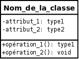
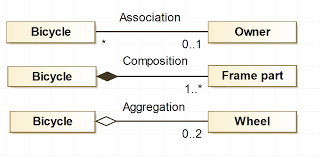
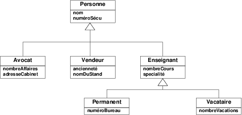

## 2.6. Diagrammes UML

### UML - Rappels

UML = Unified Modeling Language

UML est un langage standard pour modéliser visuellement des systèmes orientés objet.
Il permet de décrire, documenter et concevoir des logiciels avant de coder.

Les principales catégories de diagrammes UML

Diagrammes structurels : 

- Diagramme de classes : décrit les classes, leurs attributs, méthodes et relations.
- Diagramme d’objets : montre les instances des classes à un moment donné.
- Diagramme de composants : représente l’architecture logicielle (modules, librairies).
- Diagramme de packages : organise les classes en packages.
- Diagramme de déploiement : montre la distribution des composants sur le matériel.

Diagrammes comportementaux : 

- Diagramme de cas d’utilisation (Use Case) : représente les interactions entre utilisateurs et système.
- Diagramme de séquence : illustre l’ordre des échanges entre objets dans un scénario.
- Diagramme de communication : met l’accent sur les interactions entre objets.
- Diagramme d’état (State Machine) : décrit les états possibles d’un objet et les transitions.
- Diagramme d’activités : montre le flux de contrôle ou d’activité dans un processus.
- Diagramme de temps : suit l’évolution des valeurs dans le temps.


Dans ce chapitre nous utiliserons simplement le diagramme de classes

### Représentation d'une classe

- les attributs
- les méthodes

Accesseurs : - + #



### Représentation d'une relation de composition / agrégation



### Héritage et implémentation


#### Héritage 

Une flèche creuse (souvent montante)




#### Implémentation

Une flèche creuse (souvent montante) en pointillés 


### Dépendances entre classes

Une classe dépend d'une autre classe (ou interface) lorsqu'elle utilise dans son fonctionnement une autre classe. Par exemple, une classe ```Client``` qui, dans une de ses méthodes, instancie un nouvel objet ```Supplier```


Dans le code, cela se traduit par des imports de la classe Supplier dans la classe Client
