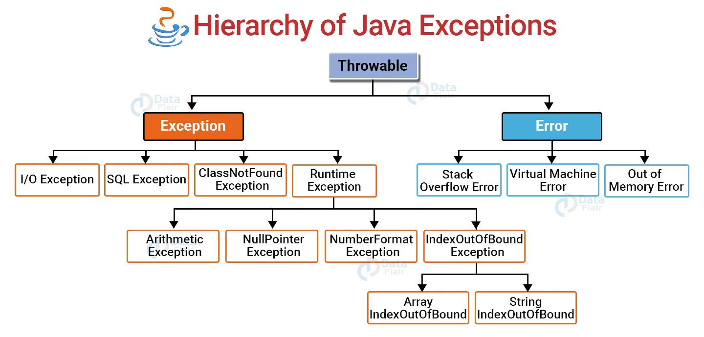

## 3.5. Gestion des erreurs

Objectif : Executer un code pouvant potentiellement planter ...

### Try/catch

Cas simple : 

```java

try{

    //division par 0
    nb = nb1 / nb2 ;
}
catch(Exception e){
    System.out.println("Oups");
    nb = 0;
}
```

### finally
```java

try{

    //division par 0
    nb = nb1 / nb2 ;
}
catch(Exception e){
    System.out.println("Oups");
    nb = 0;
}
finally {

    // la suite du code ...
    nb += 1;
}
```

### Multiple catch

```java
float resultat = 0;
Animal animal = null;

try{
    animal.direBonjour(); // Va potentiellement lever une erreur NullPointer
    resultat = a / b; // Va potentiellement lever une ArithmeticException

}
catch(ArithmeticException e)
{
    System.out.println("Division par 0");

}
catch(NullPointerException e)
{
    System.out.println("Null pointer");

}
catch(Exception e)
{
    System.out.println("Null pointer");

}

```

**Attention à l'ordre des catch**
On intercepte d'abord les exceptions spécifiques (NullPointer, Arithmetic...) avant le cas général.

Dès qu'une exception est levée, on ne va pas dans les catch suivants

### Erreurs managées ou non

Erreur managée = erreur que l'on est obligé de traiter

==> encapsuler dans un bloc try/catch
==> déclarer la méthode comme pouvant elle-même lever une exception

Hierarchie des erreurs en Java 




exemple : 

```java
Class<?> clazz = o.getClass();
Field f = clazz.getDeclaredField("propriete1"); // Cette ligne lève une exception managée
```


### mot clé Throws


indique sur une méthode que son contenu peut potentiellement lever un type d'erreur

```java
public void faireUnTrucDangereux throws DangerousException{
    
    service.methodeQuiPeutPlanter();
}
```


Si une erreur survient dans la méthode, celle-ci sera remonté au niveau de la méthode appelante


### Déclarer son propre type d'exception


Une exception est d'une classe. Il est donc possible de définir son propre type d'exception, basé sur la classe Exception ou une autre plus spécifique


```java
public class MonException extends Exception{
    
}
```


Lorsque, dans une classe, on veut lever manuellement une exception, on va faire un "throw new MonException()" :


```java
public void methode1(int p){
    
    if (p<0)
    {
        throw new MonException ("Le parametre doit etre positif ou nul");
    }
    
    // reste du traitement
    
    
}
```

Si *MonException* étend une exception *managée* : 


```java
public void methode1(int p) throws MonException{
    
    if (p<0)
    {
        throw new MonException ("Le parametre doit etre positif ou nul");
    }
    
    // reste du traitement
    
    
}
```

### Encapsulation d'erreurs


Dans des applications à plusieurs couches, il peut être interessant de lever une exception 
- là où elle se produit
- là où elle est compréhensible par le développeur, à un niveau + haut


exemple : 

```java
[...]

try{
    lirePlusieursFichiers();
} catch(Exception e){
    e.printStackTrace();
}


private void lirePlusieursFichiers() throws Exception{
    try{
        lireFichier("/home/fichier1.txt");
        lireFichier("/home/fichier2.txt");
        
    } catch(Exception e){
        throw new Exception ("Problème avec les fichiers fournis", e);
    }
}

private void lireFichier(String path) throws Exception{

    Scanner file;
    try{
        file = new Scanner(new File(path));
        [...]
    } catch (Exception e){
        throw new Exception("Fichier introuvable : " + path , e);
    } 
}
```