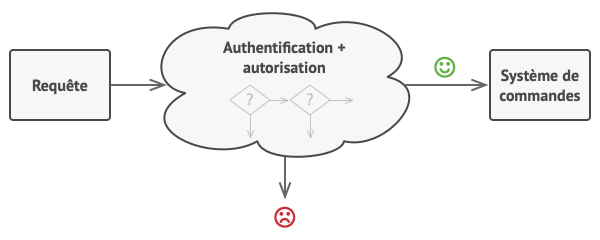
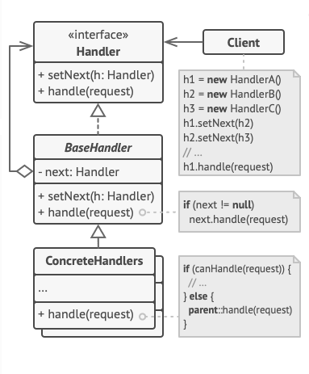

# 4. Design Patterns

## 4.1. Généralités

Un design pattern est une architecture-type, une "organisation" de classes ou de modules

- **pour répondre à une problématique classique**
- **dans un contexte donné**

Les 23 design patterns historiques ont été formalisés dans les années 90 par un groupe d'experts surnommés le "Gang Of Four".

Ils ont classé les design patterns en 3 catégories :

- **patterns de structure** : définissent des schémas entre classes, leur dépendance les unes aux autres, leur compatibilité

- **patterns de comportement** : se focalisent sur les actions-types des classes qui les composent

- **patterns de création** : répondent à la problématique "Comment créer tel ou tel type d'objet ?"

Aujourd'hui bon nombre de ces patterns sont intégrés dans les bibliothèques et frameworks modernes.

D'autres patterns, ayant un angle de vision + large ont vu le jour. Par exemple, le pattern MVC, l'architecture microservice, le Repository ...

Nous étudierons dans ce cours quelques patterns (pas tous !)

## 4.2. Iterator

Type : Comportemental
Principe : Retourner un par un des objets parmi un ensemble (fournir le suivant, le suivant ... jusqu'à la fin)

[Refactoring.guru](https://refactoring.guru/design-patterns/iterator)

Dans l'idéal on sépare les données : iterable de l'itérateur (iterator)
L'itérateur est caché "sous le capot" et se charge de parcourir les éléments
L'itérable est l'ensemble qui peut être parcouru séquentiellement par l'itérateur.

Une liste est un itérable, mais un itérable n'est pas toujours une liste !

Par exemple cet itérable infini répond au pattern de l'Iterator :

```java

public class InfiniteIterable{
    private int currentValue = 1;

    public getNext(){
        currentValue +=1;
        return currentValue;
    }

    public boolean hasMore(){
        return true;
    }
}

```

### Lien entre Iterable et boucles for

Bien souvent, un itérable peut être pris en charge nativement par le langage au sein d'une boucle "forEach"

```java


[...]

for (T element : iterable){ // possible ssi iterable implémente Iterable<T>

    [...]
}


```

==> Aller voir la définition en java de Iterable<T>

En fait, une boucle forEach revient à faire :

```
while(iterable.iterator().hasNext())
{
    T element = iterable.iterable().next();
    [...]

}

```

### MEP Python

```python

class Compteur:
    def __init__(self, n):
        self.n = n
        self.i = 1

    def __iter__(self):
        return self

    def __next__(self):
        if self.i <= self.n:
            valeur = self.i
            self.i += 1
            return valeur
        else:
            raise StopIteration


c = Compteur(5)
for nombre in c:
    print(nombre)

```

Question : Dans la classe Compteur, qu'est ce qui permet à l'objet c d'etre parcouru dans une boucle for ?

Question : que se passe-t'il si l'on fait une deuxième boucle for identique à la première sur le même objet c ?

## 4.3. Observer / Observable

Intention : Définir

- des observables, émetteurs d'évènements
- des observeurs, qui vont réagir aux évènements des "observés"

[Lien refactoring.guru](https://refactoring.guru/design-patterns/observer)

## 4.4. Composite

[Lien refactoring.guru](https://refactoring.guru/design-patterns/composite)

Intention : Organisation de classes permettant de gérer des structures arborescentes

Exemples d'utilisation :

- Système de fichiers / répertoires
- Fabrication : Notion de produits et sous-produits
- Divisions, Equipes, Groupes … Hiérarchie
- Composants graphiques : conteneurs, boutons, frames …
- Interprétation d'une expression en langage info.

### MEP Python

Le code suivant permet de représenter un système fichier grâce aux classes File et Folder.

En revanche, il ne gère pas de façon uniforme les File et les Folders.
Il est également impossible de naviguer en profondeur dans l'arborescence (de façon récursive, pour faire une recheche par exemple)

Objectifs :

- Créer une interface commune Element. Attention il n'y a pas d'interface en python, on utilisera donc une **classe abstraite**. On pourra annoter les méthodes d'instance `@abstractmethod`
- Faire en sorte que la classe Folder ne traite qu'une liste de "Element"
- Faire en sorte que le cas d'utlisation fonctionne (liste de l'arborescence complète et calcul de la taille totale)

```python

class File:
    def __init__(self, name, size):
        self.name = name
        self.size = size


class Folder:
    def __init__(self, name):
        self.name = name
        self.files = []
        self.subfolders = []

    def add_file(self, file):
        self.files.append(file)

    def add_subfolder(self, folder):
        self.subfolders.append(folder)

    def get_total_size(self):
        total = 0
        for f in self.files:
            total += f.size

        return total

    def show_structure(self):
        print(f"[Folder] {self.name}")
        for f in self.files:
            print("  " + f"- {f.name} ({f.size} ko)")
        for fol in self.subfolders:
            print("  " + f"- {fol.name}")


# Exemple d'utilisation :
root = Folder("Racine")
docs = Folder("Documents")
img = Folder("Images")

root.add_subfolder(docs)
root.add_subfolder(img)

docs.add_file(File("rapport.pdf", 200))
docs.add_file(File("cv.docx", 120))
img.add_file(File("photo.png", 1500))

root.show_structure()
print("Taille totale :", root.get_total_size(), "ko")

```

## 4.5. Proxy (procuration)

[Lien refactoring.guru](https://refactoring.guru/design-patterns/proxy)

### MEP Javascrript : Classe Proxy

Il existe en javascript une classe **Proxy**. Celle-ci permet d'altérer le comportement d'un objet en ajoutant un "gestionnaire" qui va surcharger certaines méthodes ou certaines valeurs.

https://developer.mozilla.org/fr/docs/Web/JavaScript/Reference/Global_Objects/Proxy

Partant de ce code

```javascript
const personne = {
  prenom: "Jean-Paul",
  nom: "Dupuis",
  age: 24,
  sayHello: function () {
    console.log("Hello");
  },
};
```

Nous allons créer un objet "Proxy" basé sur cet objet Personne

Dans un premier temps, nous allons simplement créer un proxy autour de l'objet, sans surcharge de fonction :

```javascript
const proxyPersonne = new Proxy(personne, {});
```

Puis nous allons ajouter des fonctions au gestionnaire pour que l'objet Proxy ait le comportement suivant :

```javascript
proxyPersonne.age = "31"; // string !
console.log(proxyPersonne.age);
==> 31 // type number

proxyPersonne.age = "abc"; // string non numérique
console.log(proxyPersonne.age);
==> 31 // consigne ignorée (sans erreur)

console.log(proxyPersonne.nomcomplet);

=> Jean-Paul Dupuis // Propriété fictive, construite à partir du nom et prénom

proxyPersonne.sayHello();

=> hello, je m'appelle Jean-Paul Dupuis // réécriture de la méthode sayHello


```

## 4.6. Strategy

Intention : Définir une famille d'algorithmes et les affecter à des objets qui utilisent ces algorithmes de façon interchangeable,

Exemples d'utilisation :

- Algorithmes d'apprentissage en deep learning

```python

from abc import ABC, abstractmethod

# --- Interface Strategy ---
class OptimizerStrategy(ABC):
    @abstractmethod
    def step(self, weights, gradients):
        pass


# --- Stratégies concrètes ---
class SGDStrategy(OptimizerStrategy):
    def __init__(self, lr=0.01):
        self.lr = lr

    def step(self, weights, gradients):
        # Descente de gradient simple
        return [w - self.lr * g for w, g in zip(weights, gradients)]


class AdamStrategy(OptimizerStrategy):
    def __init__(self, lr=0.001, beta1=0.9, beta2=0.999):
        self.lr = lr
        self.beta1 = beta1
        self.beta2 = beta2
        self.m = None
        self.v = None
        self.t = 0

    def step(self, weights, gradients):
        # Simplification extrême du vrai Adam
        if self.m is None:
            self.m = [0 for _ in gradients]
            self.v = [0 for _ in gradients]

        self.t += 1
        new_weights = []
        for i, (w, g) in enumerate(zip(weights, gradients)):
            self.m[i] = self.beta1 * self.m[i] + (1 - self.beta1) * g
            self.v[i] = self.beta2 * self.v[i] + (1 - self.beta2) * (g ** 2)
            m_hat = self.m[i] / (1 - self.beta1 ** self.t)
            v_hat = self.v[i] / (1 - self.beta2 ** self.t)
            new_weights.append(w - self.lr * m_hat / ((v_hat ** 0.5) + 1e-8))
        return new_weights


# --- Contexte : le Trainer ---
class Trainer:
    def __init__(self, optimizer_strategy: OptimizerStrategy):
        self.optimizer = optimizer_strategy

    def train_step(self, weights, gradients):
        # délégation de la mise à jour à la stratégie
        return self.optimizer.step(weights, gradients)


# --- Utilisation ---
weights = [0.5, -0.3, 0.8]
gradients = [0.2, -0.1, 0.05]

trainer = Trainer(SGDStrategy(lr=0.05))
print("SGD :", trainer.train_step(weights, gradients))

trainer = Trainer(AdamStrategy(lr=0.01))
print("Adam:", trainer.train_step(weights, gradients))

```

- Méthodes d'authentification :

```java
// "Contrat"
public interface AuthenticationProvider {
    Authentication authenticate(Authentication authentication) throws AuthenticationException;
}

// Implémentations
DaoAuthenticationProvider
LdapAuthenticationProvider
OAuth2LoginAuthenticationProvider
JwtAuthenticationProvider
```

[Lien refactoring.guru](https://refactoring.guru/design-patterns/strategy)

## 4.7. Singleton

Intention : fournir une instance unique dans l'application

- Accessible de partout
- Instance unique
- Chargée à la demande

[Lien refactoring.guru](https://refactoring.guru/design-patterns/singleton)

Implémentation en java :

```java
public final class MonSingleton {
    private static MonSingleton instance;
    private MonSingleton() {
    }

    public static MonSingleton getInstance() {
        if (instance == null) {
            instance = new MonSingleton();
        }
        return instance;
    }

    // Methodes « métier »
    public int faireUntruc(String p1){
     // ...
    }
}
```

### Caractère non thread-safe des singletons

Les singletons peuvent présenter un risque s'ils sont utilisés dans des contextes multi-threads.

```java
public final class MonSingleton {
    private static MonSingleton instance;
    private MonSingleton() {
    }

    public static MonSingleton getInstance() {
        if (instance == null) {
            // TRAITEMENT LONG
            // TRAITEMENT LONG
            // TRAITEMENT LONG
            // TRAITEMENT LONG
            // TRAITEMENT LONG
            instance = new MonSingleton();
        }
        return instance;
    }

    // Methodes « métier »
    public int faireUntruc(String p1){
     // ...
    }
}
```

Si 2 threads accèdent à très peu de temps d'intervalle à la méthode statique getInstance, la première n'aura pas fini d'instancier le singleton quand le second rentrera dans la méthode.

Il existe en java un mot-clé **synchronized** permettant de créer un mutex sur une méthode.

## 4.8. Builder

Le builder est un autre pattern de création. Il permet de séparer les étapes de création d'un objet et éviter d'avoir trop de paramètres dans le constructeur.

```java
//sans builder
Maison maMaison = new Maison(150 /* surface */, 4 /* chambres */ , 2 /* étages */ , TypeChauffage.ELEC , "tuiles" ...);

// avec Builder
MaisonBuilder builder = new MaisonBuilder();
builder.setNbChambres(4);
builder.setSurfaceHabitable(150);
builder.setNbEtages(2);
builder.setTypeChaufage(TypeChauffage.ELEC);
///...

Maison maMaison = builder.build();

// Remarque : souvent le builder a des méthodes qui renvoient this, ce qui permet de chaîner les appels de méthodes :

MaisonBuilder builder = new MaisonBuilder()
    .setNbChambres(4)
    .setSurfaceHabitable(150)
    .setNbEtages(2)
    .setTypeChaufage(TypeChauffage.ELEC)
    .build();


```

Exemple avec la construction de requêtes HTTP en tests de controller

```java

HttpRequest req = HttpRequest.newBuilder()
    .uri(URI.create(srviceUrl))
    .POST(HttpRequest.BodyPublishers.noBody())
    .header("AUthorization", "Basic " + sec)
    // ...
    .build();
```

## 4.9. Chain of Responsibility

[Lien refactoring.guru](https://refactoring.guru/design-patterns/chain-of-responsibility)

La **Chaîne de responsabilité** est un patron de conception comportemental qui permet de faire circuler des demandes dans une chaîne de handlers.

Lorsqu’un handler reçoit une demande, il décide de la traiter ou de l’envoyer au handler suivant de la chaîne.

Exemple d’application :

« Filter chain » permettant de traiter en amont une requête HTTP, AVANT d’arriver au Controller



**Structure :**



** Comment / pourquoi refactoriser **

ex. On souhaite tester la validité d'un formulaire avant de l'envoyer pour traitement à une classe de service ...

```java
if (hasCorrectName(formData))
{
    if (hasCorrectEmail(formData))
    {
        // OK  suite du traitement ...
    }
    else {
        throw new Exception ("L'email' n'est pas valide");
    }
}
else {
    throw new Exception ("Le nom n'est pas valide");
}


```

Problèmes:

- cascade de if
- difficulté de changer l'ordre des vérifications (vérifier d'abord le mail avant le nom) ou rajouter un test (test du mot de passe par exemple)

==> Refactorisation :

On va créer

- une interface "Validator"
- autant de classes que nécessaire, implémentant cette interface (1 pour chaque type de vérification)

L'execution des contrôles se fera selon une liste chaînée :

```java

Validator chainValidator = new EmailValidator()
                .setNext(new NameValidator())
                .setNext(new PasswordValidator());

try{
    chainValidator.validate(formData);
}
catch(Exception e){
    e.printStackTrace();

}

```

### MEP

Vous devez réaliser une chaîne de responsabilité qui vérifie la validité d’un mot de passe.
L’utilisateur saisit un mot de passe (dans la console) puis le programme teste certains critères.

Si les critères sont OK, un message « mot de passe enregistré » s’affiche dans la console, sinon, un message d’erreur est généré.
Vous pouvez gérer les « non-conformités » avec des exceptions.

Les critères sont les suivants :
=> + de 8 caractères
=> contient des chiffres (au moins 1)
=> contient des lettres
=> ne contient pas le mot `password` (en min ou maj)

Garder à l’esprit qu’il doit être simple de rajouter un critère à cette chaîne de resp.

Vous développerez des tests unitaires pour vérifier que

- le mot de passe `az08/kv6x:=uio` est correct
- les mot de passe `123`, `totototototo`, `123456789` sont incorrects
