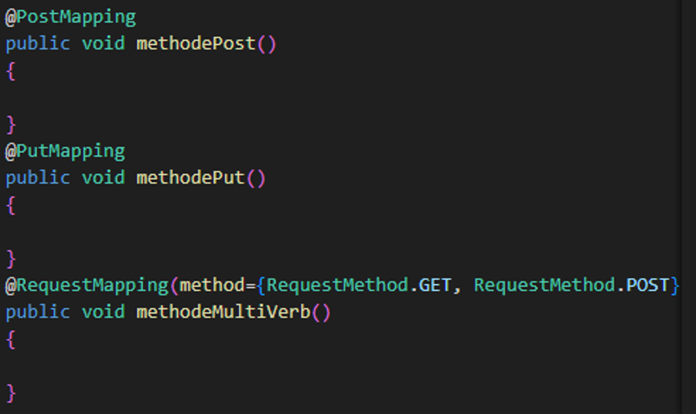

# Etude du framework SPRING

## Généralités

Spring est un framework populaire en Java. Il s'agit en réalité de plusieurs librairies compatibles entre elles. On parle d'écosystème Spring

### JEE / Jakarta EE

Dans fin des années 2000, Java EE est le framework le plus utilisé par les développeurs Java. Il est basé sur les servlets (serveurs web). Une servlet est une application web déployée dans un conteneur d'application web (comme Tomcat par exemple)
JEE devient Jakarta EE en 2018 suite au rachat de Java par Oracle et la reprise du projet par la fondation Eclipse.

Certains packages sont alors renommés, par ex.
javax.servlet => jakarta.servlet

### Spring

- Framework alternatif et open-source
- Créé en 2003
- Philosophie : favoriser la **configuration** plutôt que le codage
  => Réutiliser des fonctionnalités bas-niveau
  Tout un écosystème modulaire : MVC, Data, Security, Cloud …
- Compatible JEE / Jakarta (réutilise mêmes certaines classes)

### Spring et Spring Boot

- Spring est le noyau "historique", permet notamment l'**Injection de dépendance**

- SpringBoot est une extension de Spring. Il apporte en + :
  - l'autoconfiguration
  - un serveur embarqué
  - un packaging simplifié (possibilité de générer des .jar)

### Quelques librairies Spring

| Librairie       |                Utilisation                |
| :-------------- | :---------------------------------------: |
| Spring MVC      |           API REST, controllers           |
| ThymeLeaf       |           Moteur de rendu (SSR)           |
| Spring Security | Sécurité (authent, autorisation, SSO ...) |
| Spring Data     |             Accès aux données             |
| Spring Cloud    |      Architecture distribuée / cloud      |
| Hateos          |           API auto-documentées            |
| Actuator        |                Monitoring                 |

### Les starter-packs

Les Spring Boot Starter Packs (ou simplement starters) sont des modules de dépendances préconfigurés qui facilitent l’ajout de fonctionnalités à une application Spring Boot.

ex.

```
<dependency>
  <groupId>org.springframework.boot</groupId>
  <artifactId>spring-boot-starter-web</artifactId>
</dependency>


```

Ce starter inclut automatiquement :

- Spring MVC
- Tomcat (serveur web embarqué)
- JSON (Jackson)
- et les configurations nécessaires pour créer une API REST.

### Principe de l'inversion de contrôle

Spring utilise le principe d’inversion de contrôle.
Ce n’est pas le programme principal qui appelle les librairies, mais l’inverse !


Le développeur n'a qu'à placer ses classes métiers "au bon endroit" et laisser le framework les appeler au bon moment.

**Avantages**

- Se focaliser sur la logique métier et moins sur les fonctions support (sécurité, routage, accès aux bases, test …)
- Configuration plutôt que codage

**Inconvénients**

- Débuggage moins naturel
- Effet "magique", on ne maîtrise pas le déroulement de l'execution
- Nécessité d'apprendre le framework en + du langage natif

### Principe du modèle MVC


==> MVC= Modèle - Vue - controller

### Architecture distribuée

Principe : pouvoir déployer plusieurs instances du même service en fonction de la demande (scalabilité)


## Prise en main de Spring

### Installation de l'environnement

Vous aurez besoin de :

- Java (dernière version ou au moins 17)
- maven
- VSCode + extensions :
  Java Extension Pack
  SpringBootTools

### Hello Spring !

https://start.spring.io


- Télécharger l'archive
- Modifier la classe JolMoviesApplication.java et rajouter un `System.out.println("Hello")` dans la méthode main
- Lancer l'application grâce à l'extension Spring Boot

### Notre premier endpoint

Nous allons maintenant rajouter un "endpoint" pour faire apparaître notre "hello world" dans un navigateur

- Créer un package com.lajol.jolmovies.Controllers

- Créer une classe HelloController.java :

```java
@RestController
public class HelloController {
    @GetMapping("/hello")
    public String sayHello(){
        return "Hello, from my first controller, yeah !";
    }
}

```

- Démarrer l'appli depuis l'extension Spring Boot

- Tester dans un navigateur la page http://localhost:8080/hello

## Concepts de base de Spring Boot

### Gestionnaire de dépendance

Dans notre cas : **maven**
Permet :

- d’automatiser la récupération des dépendances du projet
- De gérer le versionning de l’artefact (notre application)
- Donner des directives de build
- Fichier pom.xml
- Alternatives : gradle

Dans d’autres langages, on retrouve le même genre d’utilitaire :

- Npm ou yarn en JS / Node
- Pip ou anaconda en python
- Composer en php/symfony

### Autoconfiguration

Vous remarquerez que vous n'avez pas du installer de server Apache ou Glassfish.
Principe : Spring Boot scanne les dépendances du classPath et "devine" la configuration. Exemple : serveur web, type de base de données …

Il est bien sûr malgré tout possible de personnaliser la configuration, grâce notamment aux classes de configuration

### Bean et conteneur IoC

Un "bean" est un objet Java réutilisable, possédant des méthodes et des propriétés, en général accessibles selon une certaine convention (get/set).

Spring contient un **conteneur IoC** ou **contexte**, un objet toujours actif au cours du cycle de vie de l'application et qui répertorie les beans déclarés ainsi que leur type (classe/interface)

L'intérêt de ce conteneur est de pouvoir à tout moment fournir un bean, soit d'un type connu, soit identifié par un nom

=> Injection de dépendance (vu + tard)

### le fichier de propriétés

application.properties

Ce fichier contient les propriétés de l'application :
N° de port, context-path, base de données, niveau de traces des logs …

En fonction des modules Spring utilisés, il permet de définir certains paramètres spécifiques à un module.

https://docs.spring.io/spring-boot/appendix/application-properties/index.html

### ComponentScan


L'annotation **SpringBootApplication** est équivalente à l'ajout de 2 annotations :
**ComponentScan**
**EnableAutoConfiguration**

Au démarrage de l'application :

- appel de la méthode statique main() (comme pour toute application Java)
- `SpringApplication.run(JolmoviesApplication.class, args);`
- création d'un contexte d'application (= conteneur IoC)
- Comme la classe JolMoviesApplication est annotée @SpringBootApplication :
  - Recherche des configurations spécifiques (classes annotées @Configuration)
  - Autoconfiguration à défaut
  - Scan des composants (y compris les contrôleurs !)
  - Création et injection des beans (beans dépendant d'autres beans)
  - Démarrage des serveurs (si application web)

> ### A vous !
>
> Modifier le fichier .properties afin que l'appli se lance non pas sur http://localhost:8080
> mais
> http://localhost:9090/jolmovies
>
> Toutes les autres routes (actuelles et futures) doivent commencer par /jolmovies/..
> Autrement dit vous devez changer :
>
> - N° de port du server
> - Path du dispatcher servlet
>
> Pour cela n'hésitez pas à consulter la doc !
>
> https://docs.spring.io/spring-boot/appendix/application-properties/index.html
>

## Les controllers

> **Rappels**
>
> Dans le modèle MVC, la couche contrôleur est celle en charge de recevoir les demandes de l'utilisateur (requêtes) et de renvoyer dans certains cas une vue à jour,
>
> Pour une application web, cela implique de traiter une requête HTTP:
>
> - Identifier la ressource demandée (https://monappli.fr/path/to/api)
> - Récupérer les paramètres ainsi que le body
> - Contrôler le droit d'accès à la ressource
> - Renvoyer un statut (200, 402 …) / du contenu

- **@Controller** : Cette annotation indique à Spring qu'il s'agit d'un composant => sera chargé dans le conteneur IoC
  Plutôt utilisé pour fournir des vues sous forme de templates (HTML)=> sera abordé + tard (Thymeleaf)

- **@RestController** : équivaut à **@Controller** + **@ResponseBody** => @ResponseBody indique que les méthodes retournent des données brutes directement
  Est + indiqué pour fournir du contenu sans mise en forme (API REST)
  Par défaut, le contenu renvoyé est parsé en json

### Gestion des routes

Un controller peut être annoté pour traiter une partie du path
Exemple : récupérer toutes les req. vers ../actor/… :


Chaque méthode définie dans un controller permet ensuite de traiter une ressource fille (exemple : http:// …/actor/hollywood)


### Méthodes (GET, POST, ...)



PutMapping, GetMapping, DeleteMapping etc ... sont équivalents à @RequestMapping + attribut method renseigné

### PathVariables


### Paramètres de requêtes

Exemple : http:// … /actor/hollywood?max=50


Variantes :
(avec paramètres optionnels)


### body de requête

Pour les requêtes autres que GET


DTO = Data Transform Objet
= objet entité "simplifié" passé en paramètre à un formulaire

=> Spring désérialise le body de la requête et crée un ActorDTO

> ### A vous !
>
> - Créer un nouveau controller pour les routes /movie/\*
> - Importer
>   - la classe de service MovieService dans le package com.lajol.jolmovies.service
>   - la classe Movie dans com.lajol.jolmovies.entity
> - Gérer les routes suivantes :
>   - GET /movie/{id} => retourne le film n° {id}
>   - GET /movie => Liste des films
>   - GET /movie?style=.. => Liste des films de genre …
>   - POST /movie => Crée un nouveau film (voir classe Movie)
>
> Tester les routes avec PostMan ou tout outil de test de votre choix
>

### Gestion des erreurs

Il est important dans une API REST de maîtriser les codes d'erreurs (statuts) renvoyés en cas d'exception.
Il existe plusieurs approches :
1/ Intercepter l'exception au niveau de la méthode
2/ Intercepter l'exception au niveau Controller
3/ Intercepter l'exception au niveau application

#### 1/ Au niveau de la méthode


#### 2/ Au niveau controller


#### 3/ Au niveau global (application)


### Message d'erreur (reason)


Par défaut, Spring ne renvoie pas le message lié à une erreur.
(Cela évite aux pirates d'avoir trop d'infos sur le fonctionnement de l'application)

Pour nos essais, nous allons rajouter ces 2 lignes dans le fichier application.properties

```
server.error.include-message=always
server.error.include-binding-errors=always
```

> ### A vous !
>
> Suite au TP précédent…
> Gérer les erreurs suivantes :
>
> - **GET /movie/{id}**
>   Si Le film n'existe pas => retourner 404 + message "le film numéro 4 n'existe pas"
> - **GET /movie?style=**
>   Le style n'existe pas retourner BAD REQUEST
> - **POST /movie**
>   Si Champ manquant OU date de production > 2025 BAD REQUEST
>   Si Titre > 100 caractères => BAD REQUEST
>

## Validation de données

### Ajout d'une dépendance

dans le fichier pom.xml :

```
<dependency>
    <groupId>org.springframework.boot</groupId>
    <artifactId>spring-boot-starter-validation</artifactId>
</dependency>

```

### "entité" ou DTO "validable"


### L'annotation @Valid

côté Controller


> ### A vous !
>
> Suite au TP précédent…
>
> - Gérer les erreurs d'ajout de film grâce à la validation.
> - La réponse de la requête doit comporter les raisons du refus de création du film
>
> AIDEZ-VOUS DE LA DOC. EN LIGNE !
>
> - Ajouter une propriété "référence" à Movie. Cette propriété doit être validée par une RegExp. Exemples de références valides : FR-889112 ; USA-003645 ; GB-793222
>

## Principe d'injection de dépendance

### Objectifs : 
- "Casser" la dépendance des classes de haut niveau envers les classes de plus bas niveau
- Etre capable de mocker facilement les classes de plus bas niveau.
Par exemple : tester la couche web en mockant la couche Service.

### Comment mettre en oeuvre la DI

1. Les classes doivent dépendre d'abstractions (interfaces ou classes abstraites)

2. Les classes ne doivent pas créer eux-même leurs sous-objets.
=> Injection de dépendance

2.1. Injection par le constructeur : 

```java

class MyController{

  private IService service;
  public MyController(IService service){
    this.service = service;
  }

}

```

2.2. Injection par paramètre : 

```java

class MyController{

  
  public methode1(IService service){
    service.doSomething();
  }

}

```

2.3. Injection par setter : 

```java

class MyController{

  private IService service;

  public void setService(IService service){
    this.service = service;
  }

}

```

### Mise en oeuvre avec Spring

Spring démarre avec un conteneur de beans.
Il scanne les composants au démarrage et les stocke dans son conteneur.
Lorsqu'une classe a besoin d'un bean (d'une dépendance), Spring est capable de lui injecter cettee dépendance.

=> Composant "injectable" :

```java

@Component
public class MyService{

}

```

=> Composant utilisant un bean :

```java


public class MyController{

  @Autowired
  private MyService service;


}

```

### Annotations 

**@Service, @Respository, @Controller**
Ces annotations étendent l'annotation @Component, elles permettent donc d'être scannées au démarrage et injectées par la suite dans une autre classe.

**MISE EN PRATIQUE**

Utilisez l'injection de dépendance avec les annotations Service et Autowired pour injecter le service MovieService dans le controller


**@Primary**
Dans le cas où l'injection est ambigüe, permet de définir un bean comme prioritaire.
Exemple : 

```java

@Component
public class DBLogger implements ILogger{

  // logger qui ecrit en base de données
}

@Component
public class FileLogger implements ILogger{

  // logger qui ecrit dans un fichier
}

@Service
public class MyService{

  @Autowired
  private ILogger logger

  // lequel Spring doit-il choisir ? 
}

```


**@Qualifier**

Permet de nommer un bean, et d'injecter un bean "préférentiel"

```java

@Component(value = "db")
public class DBLogger implements ILogger{

  // logger qui ecrit en base de données
}

@Component(value = "file")
public class FileLogger implements ILogger{

  // logger qui ecrit dans un fichier
}

@Service
public class MyService{

  @Autowired
  @Qualifier("db")
  private ILogger logger

  // lequel Spring doit-il choisir ? 
}

```

### Utilisation des profils

Il est possible de lancer Spring  avec un **profil**.
Exemple : profil de dev; de test; de préprod etc...
En fonction du profil, certains composants seront visibles par Spring, d'autres non 

- Dans la commande de lancement java
```
java -jar mon_app.jar -Dspring.profiles.active=dev
```

- Grâce à une variable d'anvironnement : 
```
set SPRING_FROFILES_ACTIVE=dev
```

- Grâce au fichier de config
application.properties :

```
spring.profiles.active=dev
```

**Annotation des composants**
Pour qu'un composant ne soit visible que sur un profil donnné :

```java

@Component
@Profile("dev")
public class MyService {

}

```

> A VOUS DE JOUER !
>
> - Extraire la classe *MovieService* dans une interface *IMovieService*
> (Aidez-vous des outils de refactoring de VSCode)
> - Renommer *MovieService* en *MovieService1* 
> - Copier la classe *MovieService1* en *MovieService2*
> - Faites en sorte que *MovieController* dépende de l'interface *IMovieService*
>
> Quelle est l'erreur levée par Spring au démarrage ?
> Comment la résoudre ?

## THYMELEAF

Thymeleaf est un moteur de rendu. Il permet de faire du SSR (server-side rendering - par opposition au CSR=Client-side rendering)

Le principe : A l'image d'autres frameworks comme twig, il permet de produire des contenus HTML en s'appuyant sur des templates.

### Dépendance à ajouter

Dans pom.xml, nous aurons besoin de la dépendance suivante : 

```
<dependency>
  <groupId>org.springframework.boot</groupId>
  <artifactId>spring-boot-starter-thymeleaf </artifactId>
</dependency>


```

### Template

Par défaut, le moteur de rendu va chercher les templates dans
/resources/templates

=> Créer un fichier /resources/templates/home.html
(et mettre une page web toute simple "Hello"...)

### Controller web

Créer un nouveau controller : HomeController

```java
@Controller
public class HomeController{

   @GetMapping(value="/home")
   public String displayHomePage(){
       return "home.html";

   }

}


```

> **MISE EN PRATIQUE**
>
> Ajouter une homepage comme dans l'exemple ci-dessus
>

### Injecter des données dans le template

```java
@Controller
public class HomeController{

   @GetMapping(value="/home")
   public String displayHomePage(Model model){
       model.addAttribute("prenom", "Sylvain")
       return "home.html";

   }

}

```


```html
<body>
    <h1 th:text = "'Bonjour ' + $prenom">
    </h1>


</body>

```

### Balises spéciales

Toutes les balises <th:***> sont interprétées par Thymeleaf
Les principales sont 
- th:text

- th:each exemple : <th:each = "element : ${movies}"/>

- th-if 

- th:ref

- th:src

- th:fragment

- th:include

- th:insert

  

> **A VOUS DE JOUER :** 
> Créer une home page affichant la liste des films disponibles